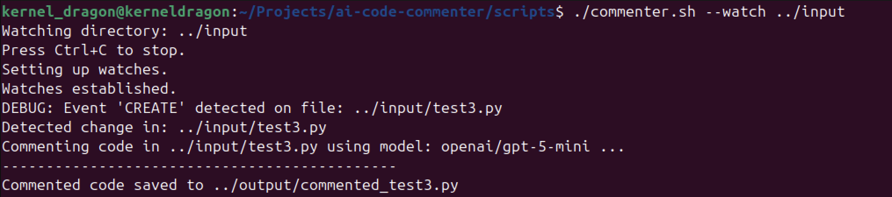

# 📝 AI Code Commenter

AI Code Commenter is a simple command-line tool that uses AI to generate clear, detailed, line-by-line comments for your code. It works with multiple programming languages and supports various AI models through [OpenRouter](https://openrouter.ai/).

---

## 🚀 Features
- Adds precise, human-readable comments to any code.
- Works with Python, JavaScript, C++, Java, and more.
- Supports multiple AI models from OpenRouter.
- Simple, one-command usage.

---

## ScreenShots
**CLI Interface**


---
## 📂 Project Structure
```

ai-code-commenter/
│
├── input/              # Original code files
├── output/             # Commented code output
├── scripts/
│   └── commenter.sh    # Main commenting script
└── .env                # API key for OpenRouter

````

---

## ⚙️ Setup

1. **Clone the repository**
   ```bash
   git clone https://github.com/yourusername/ai-code-commenter.git
   cd ai-code-commenter/scripts


2. **Install dependencies**
   Ensure you have:

   * `bash`
   * `jq`
   * `curl`

3. **Set up API key**
   Create a `.env` file in the project root:

   ```bash
   echo "OPENROUTER_API_KEY=your_api_key_here" > ../.env
   ```

4. **Make script executable**

   ```bash
   chmod +x commenter.sh
   ```

---

## 🖥 Usage

Basic:

```bash
./commenter.sh ../input/sample_code.py
```

With a custom model:

```bash
./commenter.sh ../input/sample_code.py openai/gpt-5-mini
```

---

## 📌 Example

**Input (`sample_code.py`):**

```python
def add(a, b):
    return a + b
```

**Output (`commented_sample_code.py`):**

```python
def add(a, b):
    # Adds two numbers together.
    return a + b
    # Returns the sum of a and b.
```
